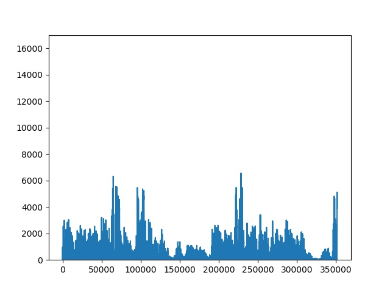

# School of AI

## Coding Challenge - Week 1

### Differentiating between Hip Hop and Electro Music

The idea between this image classification application isn't to simply distinguish between two genres, but to explore the differences between different styles of music, whether a genre or a human created music playlist that portrays a certain mood or vibe, and see whether it's possible to determine which playlist/mood/vibe a specific song best represents.

If a short sample of a song is given to the model, will the model be able to determine if the song best fits in the "hip hop" playlist or the "electro" playlist?

The idea is to provide an alternative to generic music recommender systems which mainly makes use of meta data to determine which songs or playlsits should be recommended.

### Audio to Image

To allow a CNN to train on songs, we first need to convert the audio to images.

A few things were done for creating the images that are fed into the model:

* Each audio file, which is a full song, is stripped to its raw audio data and stored as numeric values. The numeric values are plotted as a sequential line plot to represent the audio.

* Each image represents **4 seconds of audio**. Each song was split up to create a large amount of unique samples per song.

* Each 4 second sample was convulved, by taking a moving 1 second average over the 4 second sample.

* To reduce confusion for the model, the axis of the images were fixed and negative values were cut off, since the plot is essentially symmetrical around the y=0 axis.

Below follow a few image examples:

#### Hip Hop

#### Electro

### Model Performance

Performance can be visualized using TensorBoard.

